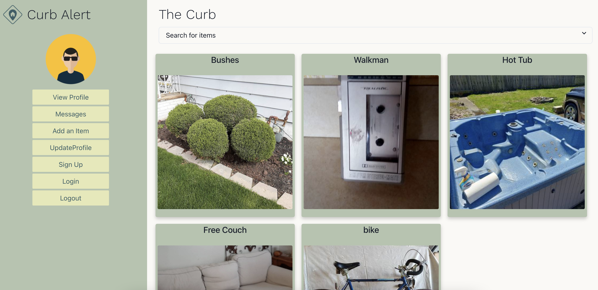

## Curb Alert
Curb Alert is an app that allows communities to recycle useful goods back into their community - offering items to their neighbors for free and reducing their carbon footprint at the same time.

# Table of Contents
* Contributors
* Languages
* Link
* Preview
* Installation
* License 

# Contributors
Danielle Fortin, Gilberto Jesus Covarrubias Merino, Zachary Svoboda, and Maria Tornabene contributed to this project.

# Languages
This project was built with HTML, CSS, JavaScript, Node, Express, React, GraphQL, MongoDB, Mongoose, and Chakra UI.

# Link 
https://github.com/Zsvoboda87/Curb-Alert
https://evening-lake-24716.herokuapp.com/  

# Preview

# Installation
Clone the repostory to your computer. Run npm i then npm run develop.

# License
This project is licensed under MIT.